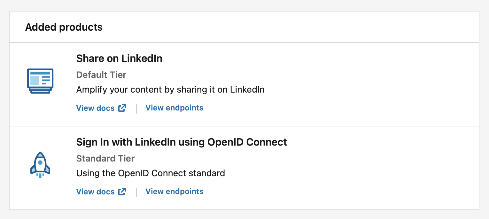

# postmatick

Rewrite and post news article(s) from around the web to [LinkedIn](https://www.linkedin.com/feed/) feed using AI.
Built using [Node.js](https://nodejs.org/) and [React.js](https://react.dev/) with [Fastify](https://fastify.dev), [OpenAI](https://openai.com) and [News API](https://newsapi.org).

## Prepare

Before beginning, make sure to have [nvm](https://github.com/nvm-sh/nvm) installed on your workstation.

Go to [linkedin.com/developers](https://www.linkedin.com/developers/) and create an app, use `http://127.0.0.1:3000/login/callback` as redirect URL. Ensure below products are whitelisted.



Also, go to [newsapi.org](https://newsapi.org/) and sign up for a free account.

You will also need to sign up for [platform.openai.com](https://platform.openai.com/), add some credits and generate an API key from there.

## Install

Clone the project and run below commands to start the project:

```shell
# install supported node.js
nvm install && nvm use

# create a .env file
cp .env.dist .env

# update LINKEDIN_*, NEWSAPI_* and OPENAI_* values

# install JS dependencies
yarn install

# generate session encryption key
node ./node_modules/@fastify/secure-session/genkey.js > session.key

# start dev server
npm start
```

Go to [127.0.0.1:3000](http://127.0.0.1:3000) in your browser to use the app.

## License

Please see [LICENSE](LICENSE) file.
