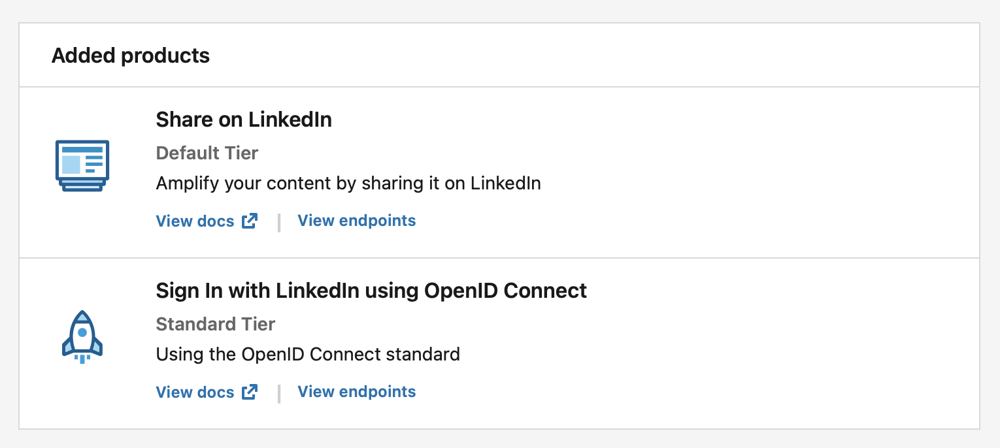

# postmatick

Rewrite and post news article(s) from around the web to [LinkedIn](https://www.linkedin.com/feed/) feed using AI.
Built using [Node.js](https://nodejs.org/) and [React.js](https://react.dev/) with [Fastify](https://fastify.dev), [OpenAI](https://openai.com) and [News API](https://newsapi.org).

## Prepare

Before you setup/install/run the project, there are certain steps to ensure proper functionality.

### SSL/TLS

To use SSL for local development, you need to have [mkcert](https://github.com/FiloSottile/mkcert) installed on your machine.
Once installed, next install the [mkcert](https://github.com/FiloSottile/mkcert)'s local CA in system's trust store.

```shell
sudo mkcert -install
```

Then generate an SSL certificate for local development using below command:

```shell
mkcert local.dev '*.local.dev' localhost 127.0.0.1 ::1
```

[Traefik](https://traefik.io/) requires you to route hostnames to your local machine.
To do so, add the following lines to your `/etc/hosts` file:

```
127.0.0.1 web.local.dev
```

### LinkedIn

Before beginning, make sure to have [nvm](https://github.com/nvm-sh/nvm) installed on your workstation.

Go to [linkedin.com/developers](https://www.linkedin.com/developers/) and create an app, use `https://web.local.dev/login/callback` as redirect URL. Ensure below products are whitelisted.



Also, go to [newsapi.org](https://newsapi.org/) and sign up for a free account.

You will also need to sign up for [platform.openai.com](https://platform.openai.com/), add some credits and generate an API key from there.

## Install

Clone the project and run below commands to start the project:

```shell
# install supported node.js
nvm install && nvm use

# create a .env file
cp .env.dist .env

# update credential values

# start dev server
docker compose up -d
```

## Code-style

The project uses [Prettier](https://prettier.io/) to enforce code-style.
To run it and fix any issues, use below command:

```shell
npx prettier . --write
```

Go to [web.local.dev](https://web.local.dev/) in your browser to use the app.

## Deployment

You can deploy the project into production (using [Docker](https://www.docker.com/)) using below commands:

```shell
# build production container
docker build -t postmatick .

# push image to registry
docker push postmatick
```

## License

Please see [LICENSE](LICENSE) file.
